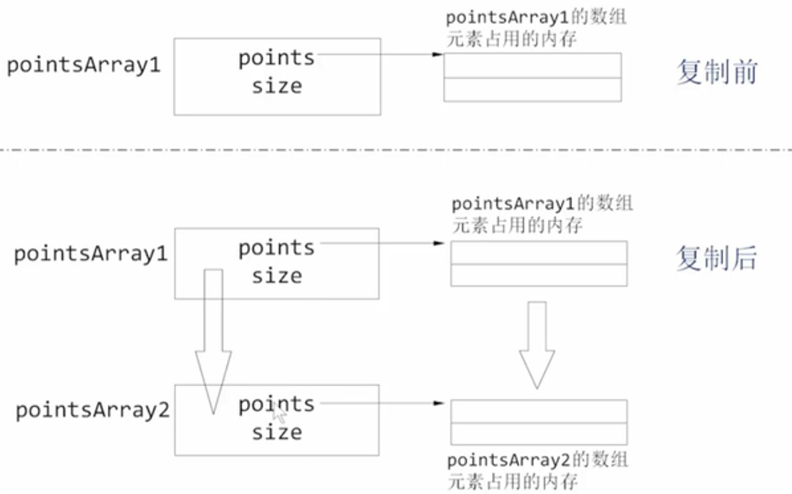

# Q&A

## 左值 & 右值

**左值 (lvalue, locator value)** 表示了一个占据内存中某个可识别的位置（也就是一个地址）的对象。

**右值 (rvalue)** 非左值即右值；是一个 不 表示内存中某个可识别位置的对象的表达式。

```C++
var = 2 // var为左值，2为右值
    
int foo() {return 2;}
int main(){
    foo() = 2; // 错误，foo是确定的返回一个右值，不能作为左值使用
    return 0;
}
int& foo(){
    return 2; // 错误，foo是返回引用，是左值，不应该返回右值
}
```


## 构造函数

### 深层&浅层

- 深层复制：对象类型为指针类型时，复制指针所指对象，重新构造对应对象分配相应内存（防止析构出错）

- 浅层复制：对应元素一一复制



### 移动构造

- 函数返回含有指针成员的对象
  - 深层复制构造，动态分配临时对象，返回主调函数是要删除临时对象
  - 移动构造：将返回的局部对象转移到主调函数，省掉构造和删除临时对象。

移动构造效率高一些


## 迭代器


## 程序运行

一个编译单元（translation unit）是指一个.cpp文件以及它所#include的所有.h文件，.h文件里的代码将会被扩展到**包含它的.cpp文件**里，然后编译器编译该.cpp文件为一个.obj文件（假定我们的平台是win32）。后者拥有PE（Portable Executable，即windows可执行文件）文件格式，并且本身包含的就已经是二进制码，但是不一定能够执行，因为并不保证其中一定有main函数。当编译器将一个工程里的所有.cpp文件以分离的方式编译完毕后，再由连接器（linker）进行连接成为一个.exe文件。

而在其他包含.h文件的cpp文件中定义的函数实际上在连接过程中再去通过连接符号到相应地址调用函数。

1. 编译main.cpp时，编译器不知道f的实现，所以当碰到对它的调用时只是给出一个指示，指示连接器应该为它寻找f的实现体。这也就是说main.obj中没有关于f的任何一行二进制代码。
2. 编译test.cpp时，编译器找到了f的实现。于是乎f的实现（二进制代码）出现在test.obj里。
3. 连接时，连接器在test.obj中找到f的实现代码（二进制）的地址（通过符号导出表）。然后将main.obj中悬而未决的call XXX地址改成f实际的地址。完成。

然而，对于模板，你知道，模板函数的代码其实并不能直接编译成二进制代码，其中要有一个“实例化”的过程。

C++标准表示，当一个模板不被用到的时侯它就不该被实例化出来，在对应的cpp文件中没有用到了`A<int>::f`，所以实际上test.cpp编译出来的test.obj文件中关于A::f一行二进制代码也没有，这是一个连接错误。但是，如果在test.cpp中写一个函数，其中调用`A<int>::f`，则编译器会将其实例化出来，因为在这个点上（test.cpp中），编译器知道模板的定义，所以能够实例化，于是，test.obj的符号导出表中就有了`A<int>::f`这个符号的地址，于是连接器就能够完成任务。

关键是：在分离式编译的环境下，编译器编译某一个.cpp文件时并不知道另一个.cpp文件的存在，也不会去查找（当遇到未决符号时它会寄希望于连接器）。这种模式在没有模板的情况下运行良好，但遇到模板时就傻眼了，因为模板仅在需要的时候才会实例化出来，所以，当编译器只看到模板的声明时，它不能实例化该模板，只能创建一个具有外部连接的符号并期待连接器能够将符号的地址决议出来。然而当实现该模板的.cpp文件中没有用到模板的实例时，编译器懒得去实例化，所以，整个工程的.obj中就找不到一行模板实例的二进制代码，于是连接器也黔驴技穷了。


