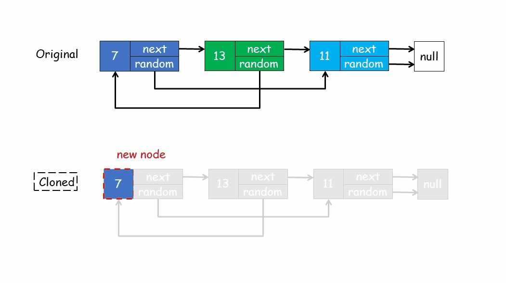
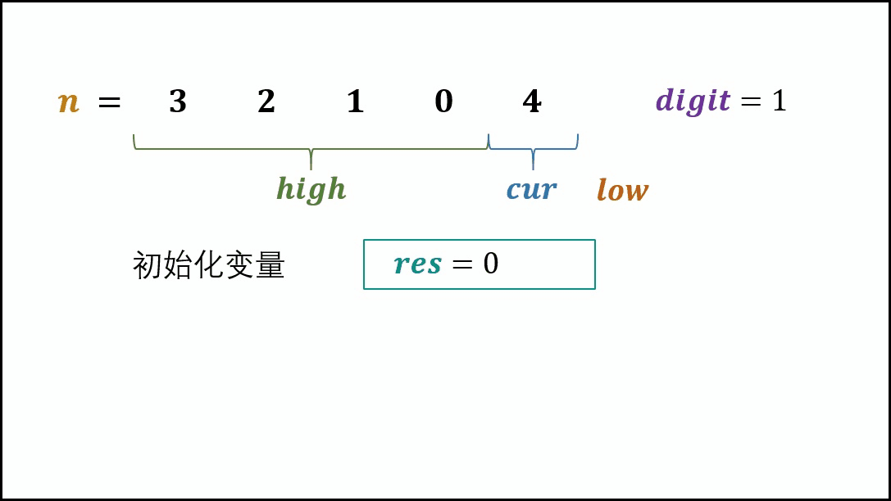

[重建二叉树]()

```C++
TreeNode* Tree(vector<int> pre,vector<int> vin, int l1, int r1, int l2, int r2){
    TreeNode* root;
    if(l1>r1) return nullptr;
    root = new TreeNode(pre[l1]);
    int i;
    for(i=l2;i<=r2;i++){
        if(vin[i]==root->val) break;
    }
    root->left = Tree(pre, vin, l1+1, l1+i-l2, l2, i-1);
    root->right = Tree(pre, vin, l1+i-l2+1, r1, i+1, r2);
    return root;
}
TreeNode* reConstructBinaryTree(vector<int> pre,vector<int> vin) {
    if(pre.size() == 0 || vin.size() == 0)
        return nullptr;
    return Tree(pre, vin, 0, pre.size()-1, 0, vin.size()-1);
}
```

[不用加减乘除做加法](https://www.nowcoder.com/practice/59ac416b4b944300b617d4f7f111b215?tpId=13&tqId=11201&tPage=3&rp=1&ru=%2Fta%2Fcoding-interviews&qru=%2Fta%2Fcoding-interviews%2Fquestion-ranking)

```C++
int Add(int num1, int num2){
        return num2 ? Add(num1^num2, (num1&num2)<<1) : num1;
}
```

[构建乘积数组](https://www.nowcoder.com/practice/94a4d381a68b47b7a8bed86f2975db46?tpId=13&tqId=11204&tPage=3&rp=1&ru=%2Fta%2Fcoding-interviews&qru=%2Fta%2Fcoding-interviews%2Fquestion-ranking)

```C++
vector<int> multiply(const vector<int>& A) {
    int n = A.size();
    vector<int> res(n);
    int mul = 1;
    for(int i=0;i<n;i++){
        res[i] = mul;
        mul *= A[i];
    }
    mul = A[n-1];
    for(int i=n-2;i>=0;i--){
        res[i] = mul * res[i];
        mul *= A[i];
    }
    return res;
}
```

[和为S的连续正数序列](https://www.nowcoder.com/practice/c451a3fd84b64cb19485dad758a55ebe?tpId=13&tqId=11194&tPage=3&rp=1&ru=%2Fta%2Fcoding-interviews&qru=%2Fta%2Fcoding-interviews%2Fquestion-ranking)

```C++
vector<vector<int> > FindContinuousSequence(int sum) { // 滑动窗口
    int l = 1;  int r = 1;  int Sum = 1;  vector<vector<int>> res;
    while(l<=r){
        r++;   Sum+=r;
        while(Sum>sum){
            Sum -= l;  l++;
        }
        if(Sum==sum && l!=r){
            vector<int> tmp;
            for(int i=l;i<=r;i++) tmp.push_back(i);
            res.push_back(tmp);
        }
    }
    return res;
}
```

[滑动窗口的最大值](https://www.nowcoder.com/practice/1624bc35a45c42c0bc17d17fa0cba788?tpId=13&tqId=11217&tPage=4&rp=1&ru=%2Fta%2Fcoding-interviews&qru=%2Fta%2Fcoding-interviews%2Fquestion-ranking)

```C++
vector<int> maxInWindows(const vector<int>& num, unsigned int size) {
	if (num.empty() || size > num.size() || size < 1) return {}; // 越界问题！！
	vector<int> s;	vector<int> res;	int count = size;
	for (int i = 0; i < num.size(); i++) {
		if (count > 0) {
			if (s.empty()) s.push_back(num[i]);
			else { // 挤掉比自己小的数
				while (s.size() >= 1 && s.back() < num[i])	s.pop_back();
				s.push_back(num[i]);
			}
			count--;
		}
		else {
			res.push_back(s[0]);
			if (num[i - size] == s[0])	s.erase(s.begin());
			while (s.size() >= 1 && s.back() < num[i]) 	s.pop_back();
			s.push_back(num[i]);
		}
	}
	res.push_back(s[0]);
	return res;
}
```

[丑数](https://www.nowcoder.com/practice/6aa9e04fc3794f68acf8778237ba065b?tpId=13&tqId=11186&tPage=2&rp=1&ru=%2Fta%2Fcoding-interviews&qru=%2Fta%2Fcoding-interviews%2Fquestion-ranking)

```C++
int GetUglyNumber_Solution(int index) {
    if(index<7) return index;
    int num; int n2 = 0; int n3 = 0; int n5 = 0;
    vector<int> Vec = {1};
    for(int i=0;i<index;i++){
        num = min(Vec[n2]*2, min(Vec[n3]*3, Vec[n5]*5));
        Vec.push_back(num);
        if(num == Vec[n2]*2) n2++;
        if(num == Vec[n3]*3) n3++;
        if(num == Vec[n5]*5) n5++;
    }
    return Vec[index-1];
}
```

[两个链表的公共节点]()

```C++
ListNode* FindFirstCommonNode( ListNode* pHead1, ListNode* pHead2) {
    if(!pHead1|!pHead2) return nullptr;
    ListNode* p1 = pHead1; ListNode* p2 = pHead2;
    while(p1!=p2){
        p1 = p1==NULL? pHead2: p1->next;
        p2 = p2==NULL? pHead1: p2->next;
    }
    return p1;
}
```

[对称二叉树]()

```C++
bool isSymmetrical(TreeNode* pRoot){
    if(!pRoot) return true;
    queue<TreeNode*> Q;  Q.push(pRoot->left);  Q.push(pRoot->right);
    while(!Q.empty()){
        TreeNode* p = Q.front(); Q.pop();
        TreeNode* q = Q.front(); Q.pop();
        if(!p&&!q) continue;
        if(!p||!q) return false;
        if(p->val!=q->val) return false;
        Q.push(p->left);   Q.push(q->right);
        Q.push(p->right);  Q.push(q->left);
    }
    return true;
}
```

[机器人运动]()

```C++
int get(int x) {
    int res = 0;
    for (; x; x /= 10) res += x % 10;
    return res;
}
int movingCount(int threshold, int row, int col){
    if(threshold<0) return 0;  if (!threshold) return 1;
    queue<pair<int, int>> Q; int dx[2] = { 0,1 }; int dy[2] = { 1,0 };
    vector<vector<int>> V(row, vector<int>(col, 0));
    Q.push(pair<int, int>(0, 0)); V[0][0] = 1; int ans = 1;
    while (!Q.empty()) {
        int x0 = Q.front().first; int y0 = Q.front().second; Q.pop();
        for (int i = 0; i < 2; i++) {
            int x = x0 + dx[i]; int y = y0 + dy[i];
            if (x<0||x>=row||y<0||y>=col||V[x][y]||get(x)+get(y)>threshold) continue;
            Q.push(pair<int, int>(x, y));
            V[x][y] = 1;
            ans++;
        }
    }
    return ans;
}
```

[复杂链表的复制]()



```C++
Node* copyRandomList(Node* head) {
    if (!head) return nullptr;
    unordered_map<Node*, Node*> m;
    Node* p = head;
    Node* pre = new Node(-1);
    Node* cur = pre;
    while(p){
        if(m.find(p)!=m.end())cur->next = m[p];
        else{
            cur->next = new Node(p->val);
            m[p] = cur->next;
        }
        cur = cur->next;
        if(m.find(p->random)!=m.end()) cur->random = m[p->random];
        else if(p->random!= NULL) {
            cur->random = new Node(p->random->val);
            m[p->random] = cur->random;
        }
        p = p->next;
    }
    return pre->next;
}
```

[二叉树&双向链表]()

```C++
TreeNode* Convert(TreeNode* pRootOfTree){
    if(!pRootOfTree) return pRootOfTree;
    TreeNode* p = pRootOfTree;  TreeNode* pre = nullptr;  stack<TreeNode*> s;
    bool isfirst = true;
    while(p||!s.empty()){
        while(p){
            s.push(p);
            p = p->left;
        }
        p = s.top();   s.pop();
        if(isfirst){
            head = p;
            pre = head;
            isfirst = false;
        }else{
            p->left = pre;
            pre->right = p;
            pre = p;
        }
        p = p->right;
    }
    return head;
}
```

[翻转字符串]()

```C++
// leetcode
string reverseWords(string s) {
    if(s.size()==0) return "";
    int begin = 0;
    int end = s.size()-1;
    reverse(s.begin(), s.end());
    while(s[begin]==' '&& begin<s.size()) begin++; // 注意边界处理
    while(s[end]==' '&& end>0) end--;
    if(begin>end) return "";
    int left = begin;
    int right;
    while(left<=end){
        right = left;
        while(s[right]!=' '&&right<=end) right++;
        reverse(s.begin()+left, s.begin()+right);
        while(s[right]==' '&&right<=end) right++;
        left=right;
    }
    int flag = begin;
    for(int i=begin;i<=end;i++){
        if(s[i]==' '&& s[i-1]==' ') continue;
        else s[flag++] = s[i];
    }
    return s.substr(begin, flag-begin);
}

// 牛客网
string ReverseSentence(string str) {
    int size = str.size();
    int start = 0;
    reverse(str.begin(), str.end());
    for(int i=0;i<size;i++){
        if(str[i]==' '){
            reverse(str.begin()+start, str.begin()+i);
            start = i+1;
        }
        if(i==str.size()-1){
            reverse(str.begin()+start, str.end());
        }
    }
    return str;
}
void ReverseWord (string &str, int l, int r){
    while(l < r){
        swap(str[l], str[r]);
        ++l;
        --r;
    }
}
```

[字符串的排列]()

```C++
void dfs(vector<string>& ans, string s, string source){
    if(source.empty()){
        ans.push_back(s);
        return;
    }
    unordered_set<char> set;
    for(int i=0;i<source.size();i++){
        if(set.count(source[i])) continue; // 防止重复的情况“aab”
        char c = source[i];
        set.insert(c);
        s.push_back(c);// 无序排列需要在dfs前减，dfs后加
        source.erase(source.begin()+i);
        dfs(ans, s, source);
        source.insert(source.begin()+i, c);
        s.pop_back();
    }
}
vector<string> permutation(string s) {
    if(s.empty()) return {};
    vector<string> res;
    dfs(res, "", s);
    sort(res.begin(), res.end());
    return res;
}
```

[整数中1出现的次数（从1到n整数中1出现的次数）]()



```C++
int NumberOf1Between1AndN_Solution(int n){
    int digit = 1; int res = 0; int high = n / 10, cur = n % 10, low = 0;
    while(high!=0||cur != 0){
        if(cur==0) res += high * digit;
        else if(cur==1) res+=high*digit+low+1;
        else res+=(high+1)*digit;
        low += cur * digit;
        cur = high % 10;
        high /= 10;
        digit *= 10;
    }
    return res;
}
```

[删除链表中重复的结点]()

```C++
ListNode* deleteDuplication(ListNode* pHead){
    ListNode* newHead = new ListNode(-1);   newHead->next = pHead;
    ListNode* pre = newHead;   ListNode* cur = pHead;
    while(cur){
        if(cur&&cur->next&&cur->val == cur->next->val){
            int val = cur->val;
            while(cur&&cur->val==val)  cur = cur->next;
            pre->next = cur;
        }else{
            pre = cur;
            cur = cur->next;
        }
    }
    return newHead->next;
}
```

[平衡二叉树]()

```C++
int height(TreeNode* root){
    if(!root) return 0;
    return max(height(root->left), height(root->right))+1;
}
bool IsBalanced_Solution(TreeNode* pRoot) {
    if(!pRoot) return true;
    return abs(height(pRoot->left)-height(pRoot->right))<=1 &&IsBalanced_Solution(pRoot->left)&&IsBalanced_Solution(pRoot->right);
}
```

[1+2+...+n 求和]()

```C++
int Sum_Solution(int n) {
    n && (n += Sum_Solution(n-1));
    return n;
}
```

[序列化二叉树]()

```C++
class Solution {
private:
    TreeNode* decode(char *&str){
        if(*str=='#'){
            str++;
            return nullptr;
        }
        int num = 0;
        while(*str!=',')   num = num*10+*(str++)-'0';
        str++;
        TreeNode* root = new TreeNode(num);
        root->left = decode(str);      root->right = decode(str);
        return root;
    }
public:
    char* Serialize(TreeNode *root) {
        if(!root){
            char* res = new char[2];
            *res = '#';
            res[1] = '\0';
            return res;
        }
        string r = to_string(root->val);
        r.push_back(',');
        char* left = Serialize(root->left);
        char* right = Serialize(root->right);
        char* ret = new char[strlen(left)+strlen(right)+r.length()+1];
        strcpy(ret, r.c_str());
        strcat(ret, left);      strcat(ret, right);
        delete left;            delete right;
        return ret;
    }
    TreeNode* Deserialize(char *str) {
        return decode(str);
    }
};
```

[二叉搜索树的第k个结点]()

```C++
int dfs(TreeNode* root){
    if(!root) return 0;
    return dfs(root->left)+dfs(root->right)+1;
}
TreeNode* KthNode(TreeNode* pRoot, int k){
    if(!pRoot) return nullptr;
    int left = dfs(pRoot->left);
    if(k==left+1) return pRoot;
    else if(k<=left) return KthNode(pRoot->left, k);
    else return KthNode(pRoot->right, k-left-1);
}
```

[数据流中的中位数]()

```C++
class MedianFinder {
private:
    vector<int> minHeap;
    vector<int> maxHeap;
public:
    /** initialize your data structure here. */
    MedianFinder() {}
    void addNum(int num) {
        if(((minHeap.size()+maxHeap.size())&1)==0){ // 偶数插入最小堆
            if(maxHeap.size()>0&&maxHeap[0]>num){ // 最大值大于num
                maxHeap.push_back(num);
                push_heap(maxHeap.begin(),maxHeap.end(),less<int>());
                num = maxHeap[0];
                pop_heap(maxHeap.begin(),maxHeap.end(),less<int>());
                maxHeap.pop_back();
            }
            minHeap.push_back(num);
            push_heap(minHeap.begin(), minHeap.end(), greater<int>());
        }
        else{
            if(minHeap.size()>0&&minHeap[0]<num){
                minHeap.push_back(num);
                push_heap(minHeap.begin(),minHeap.end(),greater<int>());
                num = minHeap[0];
                pop_heap(minHeap.begin(),minHeap.end(),greater<int>());
                minHeap.pop_back();
            }
            maxHeap.push_back(num);
            push_heap(maxHeap.begin(), maxHeap.end(), less<int>());
        }
    }
    
    double findMedian() {
        int size = maxHeap.size()+minHeap.size();
        if(size==0) throw invalid_argument("No numbers are available!");
        if(size&1)  return double(minHeap[0]);
        else  return ((double)minHeap[0]+(double)maxHeap[0])/2;
    }
};
```

[二叉树的下一个结点]()

```C++
TreeLinkNode* GetNext(TreeLinkNode* pNode){
    if(!pNode) return nullptr;
    TreeLinkNode* next = nullptr;
    if(pNode->right){ // 遍历右节点的左节点
        TreeLinkNode* p = pNode->right;
        while(p->left) p = p->left;
        next = p;
    }
    else if(pNode->next){ // 遍历父节点
        TreeLinkNode* parentNode = pNode->next;
        TreeLinkNode* currentNode = pNode; 
        while(parentNode != nullptr  && currentNode == parentNode->right){
            currentNode = parentNode; // 如果当前为父节点的右节点，访问父节点的父节点
            parentNode = parentNode->next;
        }// parentNode!=nullptr 判断该节点是中序遍历的最后一个节点，访问到根节点后无法向上，退出
        next = parentNode;
    }
    return next;
}
```

[矩阵中的路径]()

```C++
bool dfs(char* Mat,int r,int c,char* str,vector<vector<int>>& V,int rows,int cols){
    if(*str=='\0') return true;
    int index = r*cols+c;
    if(r<0||r==rows||c<0||c==cols||V[r][c]||Mat[index]!=*str) return false;
    str++;    visited[r][c]=1;
    return dfs(Mat, row+1, col, str, V, rows, cols)||
        dfs(Mat, row-1, col, str, V, rows, cols)||
        dfs(Mat, row, col+1, str, V, rows, cols)||
        dfs(Mat, row, col-1, str, V, rows, cols);
}
bool hasPath(char* matrix, int rows, int cols, char* str){
    for(int i=0;i<rows;i++){
        for(int j=0;j<cols;j++){
            vector<vector<int>> visited(rows, vector<int>(cols, 0));
            if(dfs(matrix, i, j, str, visited, rows, cols)){
                return true;
            }
        }
    }
    return false;
}
```

[栈的压入、弹出序列]()

```C++
bool IsPopOrder(vector<int> pushV,vector<int> popV) {
    stack<int> s;
    int index = 0;
    for(int num:pushV){
        s.push(num);
        while(!s.empty()&&s.top()==popV[index]){
            index++;
            s.pop();
        }
    }
    return s.empty();
}
```

[二维数组中的查找]()

```C++
bool Find(int target, vector<vector<int> > array) {
    if(array.size()==0||array[0].size()==0) return false;
    int i = 0;
    int j = array[0].size()-1;
    while(i<array.size()&&j>=0){
        if(array[i][j]==target) return true;
        else if(array[i][j]>target) j--;
        else i++;
    }
    return false;
}
```

[把数组排成最小的数]()

```C++
static bool smaller(int num1, int num2) {
    int n = num1;
    int bit1 = 0; int bit2 = 0;
    while (n) { bit1++; n /= 10; }
    n = num2;
    while (n) { bit2++; n /= 10; }
    if(num2==0) bit2=1;
    if(num1==0) bit1=1;
    long long x = num2 + num1 * pow(10, bit2);
    long long y = num1 + num2 * pow(10, bit1);
    return x < y;
}
string int2string(int i) {
    if(i==0) return "0";
    string res = "";
    while (i) {
        res.insert(res.begin(), i % 10 + '0');
        i /= 10;
    }
    return res;
}
string PrintMinNumber(vector<int> numbers) {
    sort(numbers.begin(), numbers.end(), [](int &num1, int &num2) {
        return smaller(num1, num2);
    });
    string res = "";
    for (int i : numbers) {
        res += int2string(i);
    }
    return res;
}
```

